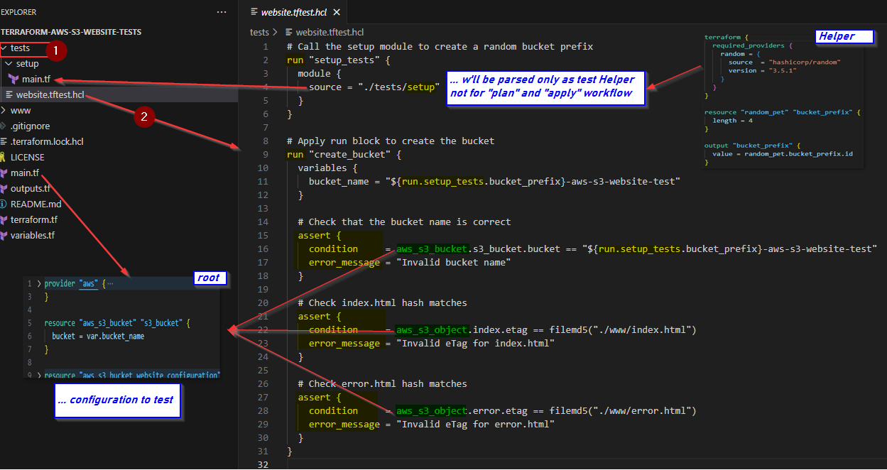

# Learn Terraform - Test

This is the companion repo to the [Write Terraform Tests](https://developer.hashicorp.com/terraform/language/tests) tutorial.

## Write Terraform Tests
Terraform tests let you **validate your module** configuration **without impacting your existing state file** or **resources**. Testing is a separate operation that **is not part** of a `plan` or `apply` workflow, but instead builds ephemeral infrastructure and tests your assertions against *in-memory state* for those short-lived resources. This lets you safely verify changes to your module without affecting your infrastructure.
Sample:
<<<<<<< HEAD

=======

>>>>>>> 0b6a0908103652f6fe21b43b0be911452673571e
